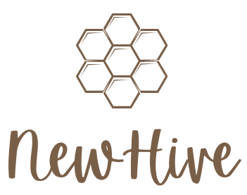
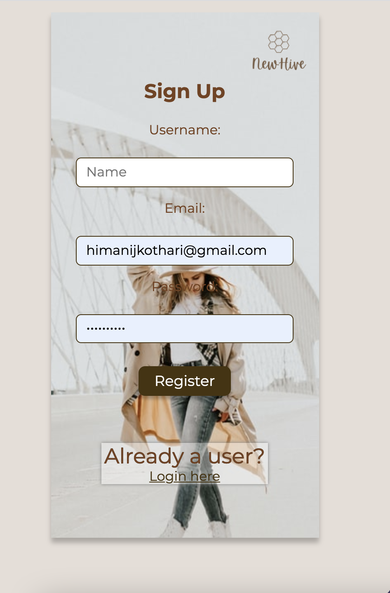
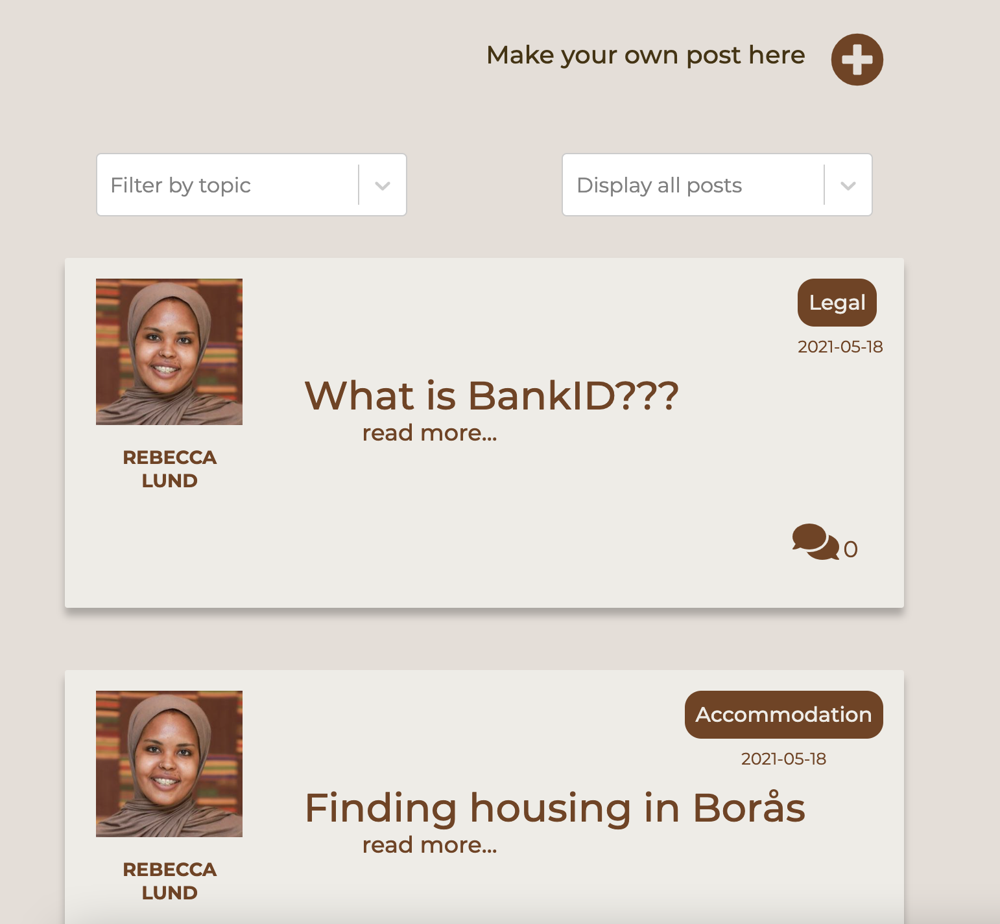
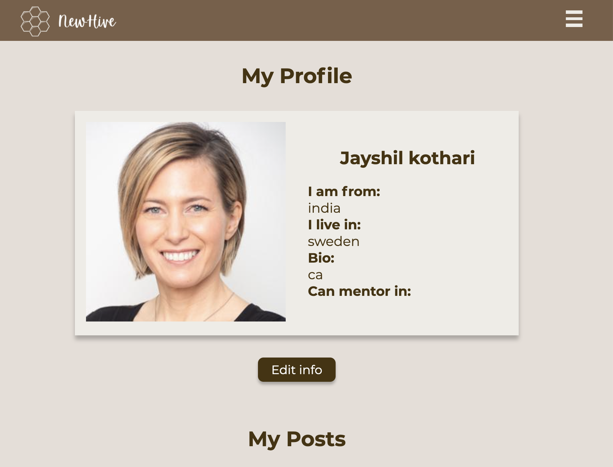
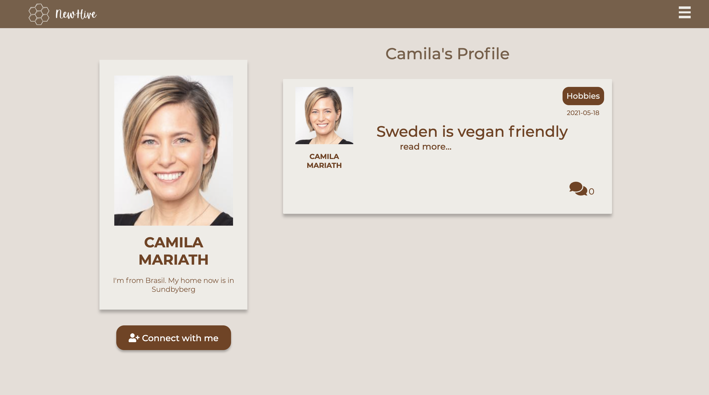
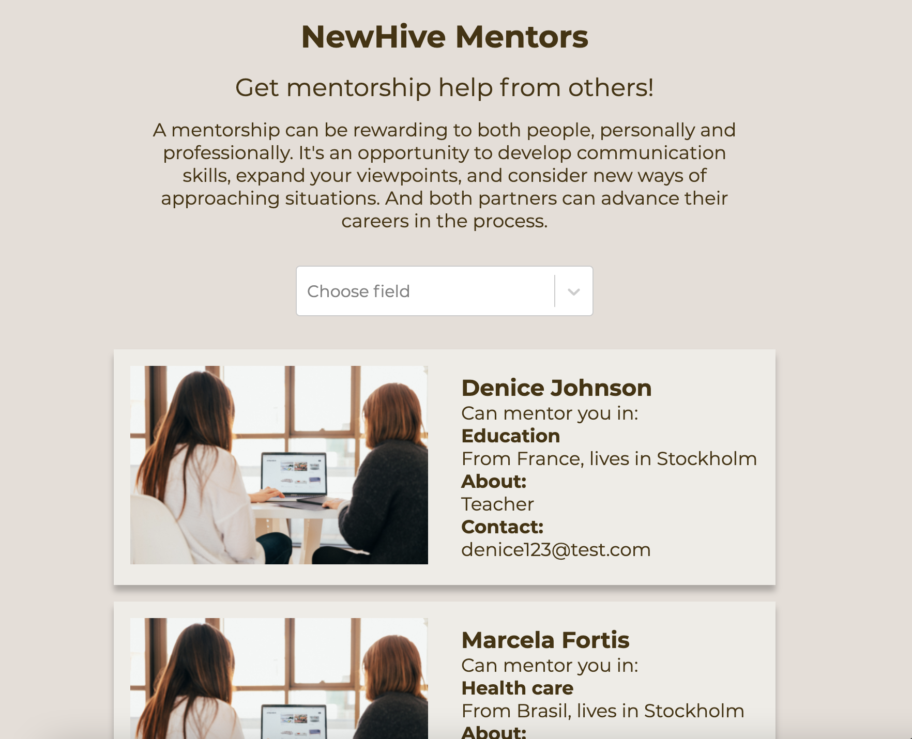
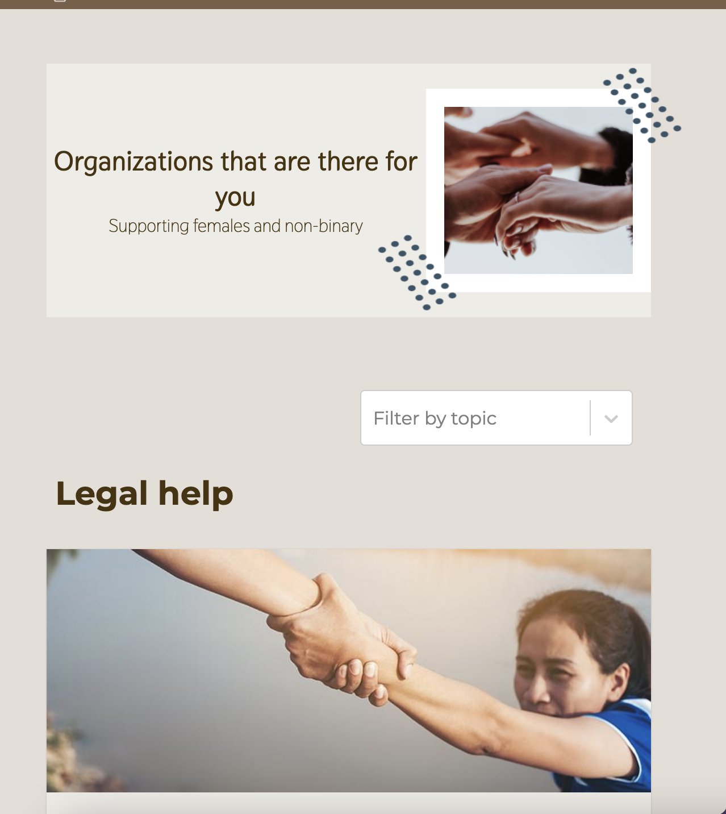
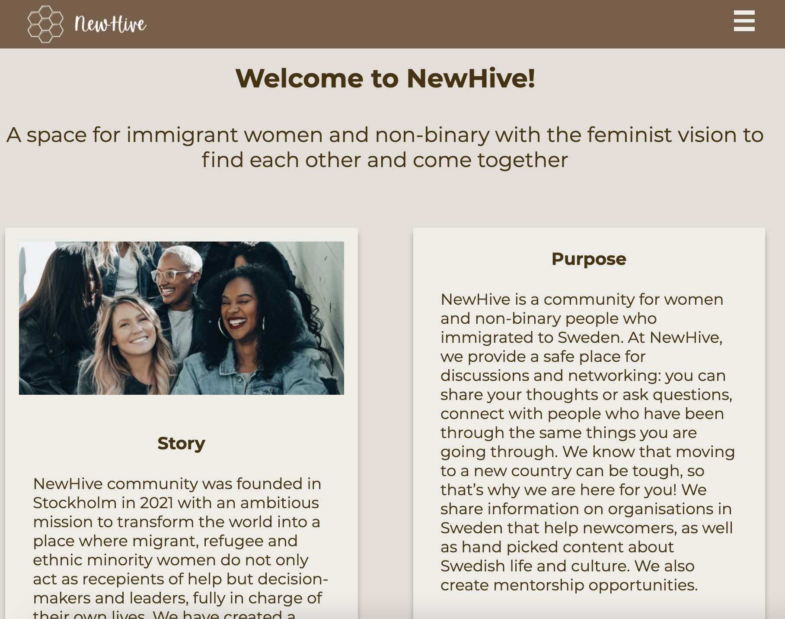
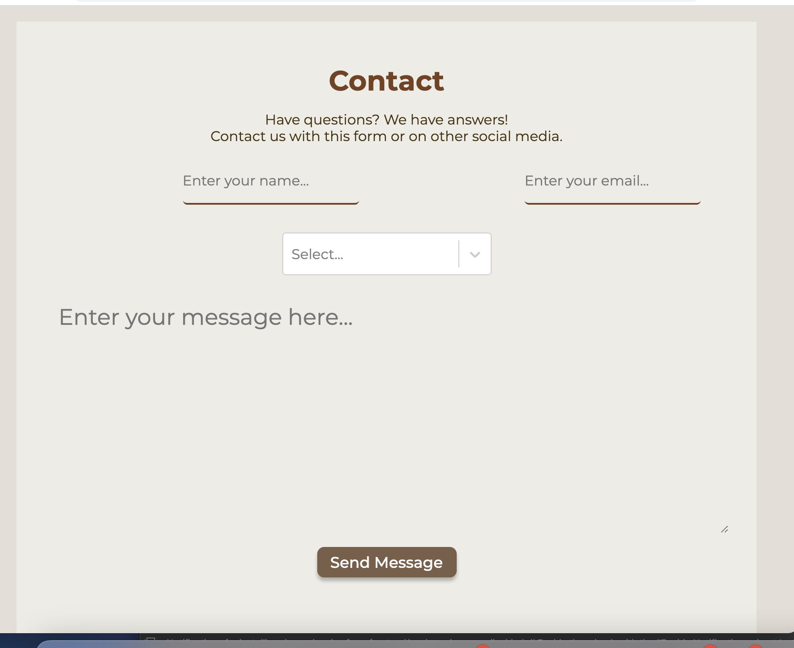

<p align="center">

</p>

# NewHive

NewHive is a social media platform in Sweden where immigrant women and non-binary people with a feminist perspective can meet and connect.We are a feel-good social network that brings diverse women together for meaningful and supportive conversations. It's a social network platform that you may use on your phones, tablets, laptops, and computers.

## Story

NewHive community was founded in Stockholm in 2021 with an ambitious mission to transform the world into a place where migrant, refugee and ethnic minority women do not only act as recepients of help but decision-makers and leaders, fully in charge of their own lives. We have created a space for immigrant women and non-binary with the feminist vision to find each other, come together and find ground for collaborative work across our differences. Our members create safe spaces for the most discriminated against persons in our societies - migrant and refugee women. Where they come to heal, exchange, learn and co-create their own lives and stories.

## Purpose

- Provides a private environment where women and non-binary people can freely voice their ideas and doubts.
- We care about the connections for those who are new, not likes or popularity.
- Provides a **Mentoring** relationship for persons seeking guidance and assistance in their personal and professional growth.
- Provides information about organizations that may be useful if someone requires assistance with a specific topic.
- For those who are new to Sweden, there is a section where you may find some fascinating content about the country.

## Preview

Follow this link to see the project: https://secret-waters-48687.herokuapp.com/

You will need to create an account to have access to the services of the website.


## Setup
Our development environment for a full-stack web application will consist of three main parts:

1. Database (Postgres).
2. Backend server (Spring).
3. Frontend development server (React).

### Prerequisites
- `docker` and `docker-compose`.
- `nodejs`.

### Starting the database
In the root folder, run
```
docker-compose up
```

### Starting the backend server
Open the root folder and run
```
./gradlew bootRun
```

### Starting the frontend development server
The frontend application is in the directory `frontend`. From there, run 
```
npm install
```
to install all the dependencies needed for the project.

Then start the frontend application by running
```
npm start
```

## REST API

We have implemented API in Spring boot with postgreSQL database. Below mentioned are the endpoints provided to use specific function.

### USER Routes

| HTTP Method | HTTP Path | Action |
| ------------|-----------|--------|
| `POST` |`/register` | should register a user. |
| `GET` | `/authenticate` | authenticate the user who tries to login.|
| `POST`| `/user` | returns loggedIn user.|

### POST Routes
| HTTP Method | HTTP Path | Action |
| ------------|-----------|--------|
| `POST` |`/posts` | create a new post. |
| `GET` | `/posts` | returns all posts.|
| `GET`| `/posts/{id}` | return a specific post by provided Id.|
| `PUT`| `/posts/{id}` | update a specific post by provided Id.|
| `DELETE`| `/posts/{id}` | delete a specific post by provided Id.|
| `GET`| `/posts?topic={topicname}` | returns all posts by which are related to specified topic.|
| `GET`| `/posts?author={author}` | returns all posts by which are written by specified author.|
| `GET`| `/postOfConnections` | returns all posts made by users to whom logged-in user follows.|

### COMMENT Routes

| HTTP Method | HTTP Path | Action |
| ------------|-----------|--------|
| `POST` |`/comments/{postId}` | create a comment on post mentioned by postId. |
| `GET` | `/comments/{postId}` | returns all comments on post mentioned by postId.|
| `GET`| `/comments` | return all comments.|
| `DELETE`| `/comments/{commentId}` | deletes the comment by provided Id.|
| `PUT`| `/comments/{commentId}` | updates the comment by provided Id.|

### PROFILE Routes

| HTTP Method | HTTP Path | Action |
| ------------|-----------|--------|
| `POST` |`/create-profile` | create a profile of the currently loggedin user. |
| `GET` | `/view-profile` | user can view his profile.|
| `GET`| `/view-profile/{ProfileId}` | view profile of specified by profileId.|
| `GET`| `/view-profile-by-email/{email}` | view profile of the user whose email is specified by the parameter.|
| `PUT`| `/edit-profile` | update the user profile.|
| `GET`| `/mentors?isMentor=true` | returns all the user profile who are ready for mentorship.|
| `GET`| `/mentors?mentorArea={mentor-area}` | returns all the user profile who are ready to be mentor on area specific by mentor-area.|

### FOLLOWER Routes

| HTTP Method | HTTP Path | Action |
| ------------|-----------|--------|
| `PUT` |`/follower/add/{profileId}` | add loggedIn user as a follower of a profile mentioned by profileId. |
| `DELETE` |`/unfollower/remove/{profileId}` | delete the connection between the user who is loggedin and profile mentioned by profileId. |
| `GET` |`/isFollower/{profileId}` | checks if loggedin user is follower of the profile mentioned by profileId. |

# User Manual

## Signup page

User can Sign up via entering Name, Email and password when he is not a member of community.



### Feed page
As soon as User register, It lands to feed page, where he can see posts of the members of community.



### Profile page

A user can enter his information to make his profile more informative via My Profile page in menu.

After updating his information he can view his profile.



### Public profile page

When user click to the user-card on the post, he can view the profile of a user who wrote the post and also other post written by that user.
User can also make a connection request to other using via clicking "connect with me" button.



### Mentorship page

User can view the profile of the mentor who are expertise in the area mentioned in the profile. If user wants mentorship, he can contact mentor via email provided in the mentor card.User can visit this page via hamburger menu



### Organization page

This page provides information about organizations that may be useful if someone requires assistance with a specific topic. User can visit this page via hamburger menu.



### FAQ about Sweden

For those who are new to Sweden, there is a section where you may find some fascinating content about the country.User can visit this page via hamburger menu.


### About page

User can find the vision and mission of your community in the above page. This page can be accessed by clicking "about" in footer.



### Contact page

User can contact the community via contact-form for some question or suggestions.



# Author

Created between Apr 22 - May 19 2021 as a final group project for Software Development Academy, iteration 9, by:

- Ahmed N.A.Ismail
- Himani Paronigar
- Marcela Felix Fortis
- Natalia Fedorova
- Nirali V Thakar
- Olha Pinchuk

